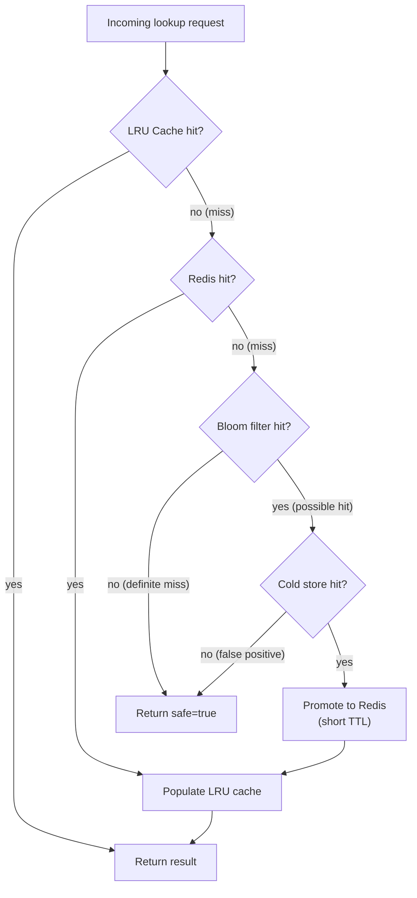
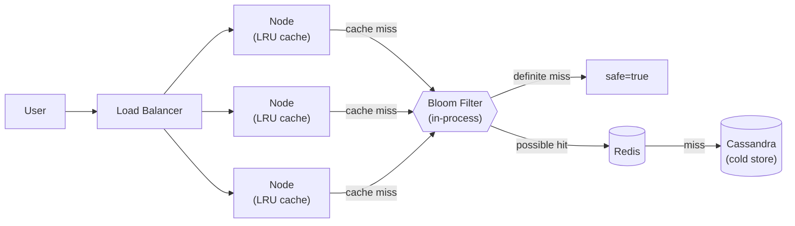
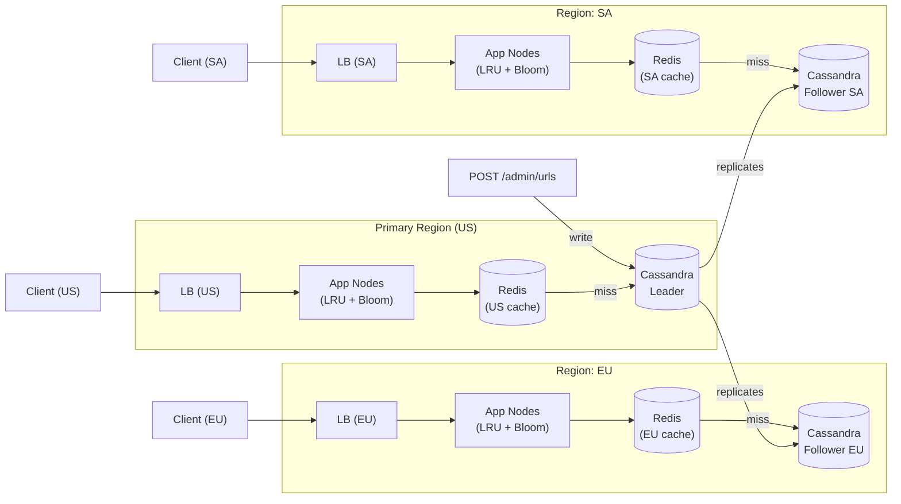

# URL Threat Lookup

A URL safety lookup service built with Go (Gin), Redis, and an in-process LRU cache.

## Startup

```bash
docker-compose up --build
```

The service starts on **port 8080**. Seed data from `data/blocklist.json` is loaded automatically on startup.

---

## Quick test curl examples

### 1. Safe URL
```bash
curl http://localhost:8080/urlinfo/1/safe.example.com/about
```
response:
```json
{
  "url": "safe.example.com/about",
  "safe": true,
  "threat_category": "none",
  "degraded": false,
  "checked_at": "2026-04-30T14:00:00Z",
  "version": 1
}
```

### 2. Health check
```bash
curl http://localhost:8080/health
```
response:
```json
{"redis": "ok", "status": "ok"}
```
Returns `503` with `"status": "degraded"` when Redis is unreachable.

### 3. Add URLs to the blocklist
```bash
curl -X POST http://localhost:8080/admin/urls \
  -H "Content-Type: application/json" \
  -d '[{"url":"new-evil.com/malware","threat_category":"malware"}]'
```
response:
```json
{"added": 1}
```

### 4. Prometheus metrics
```bash
curl http://localhost:8080/metrics
```

---

## Response Schema

| Field | Type | Description |
|---|---|---|
| `url` | string | The full URL that was checked (`hostname:port/path?query`) |
| `safe` | bool | `true` when the URL is not in the blocklist |
| `threat_category` | string | `"none"` \| `"malware"` \| `"phishing"` \| `"spam"` |
| `degraded` | bool | `true` when Redis was unreachable and the service is failing open |
| `checked_at` | string (RFC 3339) | UTC timestamp of when the lookup was performed |
| `version` | int | Schema version, currently `1` |

---

## Endpoints

| Method | Path | Description |
|---|---|---|
| `GET` | `/urlinfo/1/{hostname_and_port}/{path_and_query}` | Look up a URL's threat status |
| `POST` | `/admin/urls` | Add URLs to the blocklist (JSON array) |
| `GET` | `/health` | Redis connectivity and overall service health |
| `GET` | `/metrics` | Prometheus metrics in exposition format |

---

## Makefile targets

| Target | Description |
|---|---|
| `make build` | Build the Docker image |
| `make up` | Start the full stack (app + Redis) |
| `make down` | Stop and remove containers |
| `make test` | Run all unit and integration tests |
| `make seed` | Re-load `data/blocklist.json` via the admin API |

---

## Architecture

```
caller → GET /urlinfo/1/{host}/{path} → Handler
                                           │
                                    LRU Cache (10k entries, 5min TTL)
                                           │ miss
                                         Redis
                                           │ not found
                                       safe=true
```

Each service instance is stateless — all durable state lives in Redis. The in-process LRU cache absorbs repeated lookups for hot URLs. On Redis failure the service fails open (`safe=true`, `degraded=true`) to keep the proxy unblocked, while signalling the degraded state to the caller.

---

## Known Issues

The following items were intentionally omitted to keep this a simple, testable prototype:

- **No authentication on `POST /admin/urls`**
- **No Bloom filter**
- **No request body size limit**
- **No graceful shutdown**
- **No input validation on blocklist entries**

---

## Part 2 — Design Questions

### The size of the URL list could grow infinitely. How might you scale this beyond the memory capacity of the system?

As the blocklist grows beyond what can reasonably be stored in Redis (RAM), a tiered storage allows RAM usage to be a fixed limit while preserving all data and fast lookups:

1. **Cold storage** — move entries that have not been hit within a configurable window out of Redis and into a disk-based store (like DynamoDB, Cassandra, or RocksDB on local disk). Redis holds the hot working set in memory; a background job handles eviction to cold storage.
2. **Bloom filter** — by adding cold storage, each request not present in the blocklist would have to do a round trip to the disk-based storage before returning {"safe": true}, which would add significant latency. Before querying the cold storage, we use a Bloom filter. The Bloom filter has no false negatives, so a "not present" answer means the URL is definitively absent from the cold store and the disk read is skipped entirely.
3. **Lookup path** — the service checks the LRU cache first, then Redis on a cache miss, then the Bloom filter on a Redis miss. If the filter reports absent, return `safe=true` immediately. On a filter hit, read the cold store to confirm and retrieve metadata; a confirmed hit is promoted back into Redis with a short TTL so subsequent lookups stay fast.



**Extra:** Increasing the hot set capacity: Redis Cluster for sharding the hot set if it grows too large for a single node, and a Pub/Sub channel or Redis Streams consumer group to broadcast cache invalidation events across instances after blocklist updates.

---

### The number of requests will exceed the capacity of a single system. How might you solve this, and how might this change if you have to distribute the workload to an additional region such as Europe?

**Single region:** By separating Redis from the node and placing it in front of Cassandra, all durable state lives on disk — Redis acts as a hot cache, not the source of truth. Scaling out is a matter of running more replicas behind a load balancer (NGINX, HAProxy, AWS ALB, etc.). Each node runs an in-process LRU cache and Bloom filter; the Bloom filter short-circuits the vast majority of safe-URL lookups before they ever reach Redis, so Redis only sees traffic for URLs that are plausibly in the blocklist.



**Multi-region:** Because blocklist writes are infrequent (a few thousand URLs per day) but reads are extremely high volume, single-leader replication is the right model. All writes go to one leader; read-only followers in each region serve local traffic with sub-millisecond latency. A Redis cache sits in front of each follower so the vast majority of lookups never reach Cassandra at all. Replication lag is typically a few hundred milliseconds — acceptable for a threat feed where a URL that was just added being served as safe for a brief window is tolerable. If strict consistency is required, reads can be forced to the leader at the cost of cross-region latency.



---
### What are some strategies you might use to update the service with new URLs? Updates may be as much as 5,000 URLs a day with updates arriving every 10 minutes.

At ~35 URLs per 10-minute window, the volume is low. But considering the solution proposed so far, the update pipeline has three distinct concerns: writing to the store, invalidating caches, and rebuilding the Bloom filter.

**Writing to the store** — a cron job or webhook consumer POSTs each batch to `POST /admin/urls`, which writes to the Cassandra leader. Replication to followers propagates within a few hundred milliseconds. At this rate, a simple HTTP push is sufficient; no queue is needed.

**Invalidating caches** — the node that receives the POST invalidates its own LRU cache, but peer nodes remain stale until TTL expiry (5 minutes). For a threat feed this is acceptable — a newly added URL being served as safe for a few minutes is a tolerable window. If the window must be tighter, a Redis Pub/Sub channel or Redis Streams consumer group can broadcast invalidation events to all nodes after each batch write.

**Rebuilding the Bloom filter** — a Bloom filter is append-only; entries cannot be removed. Each update batch adds new URLs to the filter. A full rebuild (from the current Cassandra snapshot) is needed. A background goroutine can do this on a configurable schedule with a hot-swap (build the new filter in memory, then atomically swap the pointer). No downtime, no missed lookups.

For higher rates or stricter auditability, a robust solution would be to implement **pull-based versioned feed**: where the updater publishes a diff, and each instance polls, diffs against its last-seen version, and applies adds/removes

---

### You're woken up at 3am. What are some of the things you'll look for in the app?

In rough order of check:

1. **Health endpoint:** `GET /health` returns `{"status":"degraded"}` and HTTP 503 when Redis is unreachable. A load balancer could already be draining the instance.
2. **Prometheus metrics:**`url_lookup_errors_total` (degraded-mode activations), `url_lookup_duration_seconds`, and `url_lookup_requests_total` rate. A spike in errors or latency narrows the scope immediately.
5. **Logs:** each request logs `url`, `safe`, `cache_hit`, `latency_ms`, `degraded`, and `error`. Search for `"degraded":true` or non-empty `"error"` fields to find the first failing request and its timestamp.
6. **Process state:** CPU and memory of the app containers. An unexpected memory spike would suggest the in-process Bloom filter or LRU cache is larger than expected.
7. **Cassandra replication lag:** if Redis is healthy but lookups are slow, check whether a follower has fallen behind the leader. A lagging follower will produce stale reads and force more cache misses down to disk.
8. **Bloom filter false-positive rate:** a spike in Cassandra reads without a corresponding spike in confirmed blocklist hits suggests the false-positive rate has grown (filter too full, not yet rebuilt). Check the last rebuild timestamp.

---

### Does that change anything you've done in the app?

Yes — I'd add more metrics, better logs, and alert rules. For example, an `alerts.yaml` for Prometheus Alertmanager (set it to trigger when `url_lookup_errors_total` rate stays elevated for more than 2 minutes) would notify on-call engineer before a user reports a problem. 
Beyond this, if the root cause turned out to be a specific problem, like for example the Bloom filter getting too full and throwing too many false positives, I'd add a metric tracking how full the filter is and alert when it gets too full, so the problem is caught before it starts sending unnecessary reads to Cassandra. Similarly, if the issue was Cassandra replication lag, I'd add a metric for follower lag and alert on that too — the pattern is the same: when the checklist surfaces a blind spot, close it with a metric and an alert.

---

### What are some considerations for the lifecycle of the app?

- **Dependency updates** — Go modules and base Docker images (`golang:1.22-alpine`, `alpine:3.19`) need periodic updates to pick up security patches.
- **Bloom filter rebuild cadence** — as the blocklist grows and URLs are removed, the filter's false-positive rate creeps up. Schedule a nightly hot-swap rebuild from the Cassandra snapshot.
- **Schema versioning** — the response includes `"version": 1`. If the response shape changes, increment the version and support both versions during a transition window so callers can migrate without a flag day.
---

### You need to deploy a new version of this application. What would you do?

1. **Build and tag** — CI builds the Docker image and tags it with the git SHA (`sha-abc1234`) and a semantic version (`v1.2.0`). `latest` tag is never used in production.
2. **Run tests** — the full `go test ./...` must pass before the image is promoted.
3. **Rolling deploy** — in Kubernetes, update the `Deployment` image tag. Kubernetes performs a rolling update: new pods start, pass their readiness probe (`GET /health` returning 200), and only then does traffic shift. Old pods are terminated after their connections drain. This gives zero downtime and an instant rollback path (`kubectl rollout undo`).
4. **Bloom filter warm-up** — new pods start with an empty in-process Bloom filter. On startup, the node fetches the latest filter snapshot from object storage (or rebuilds from Cassandra) before joining the load balancer pool, so it never serves inflated false-positive rates during the warm-up window.
5. **Verify** — watch `url_lookup_errors_total`, `url_lookup_duration_seconds`, and Cassandra read rate for 5–10 minutes post-deploy. A spike in Cassandra reads on new pods indicates the Bloom filter or LRU cache has not warmed yet. Roll back if error metrics degrade.
6. **Outside Kubernetes** — the same pattern applies with a load balancer: bring up new instances, warm their caches, add them to the pool, then drain and terminate old instances one at a time.